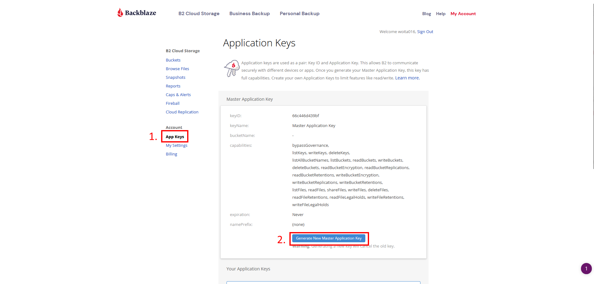

# Image upload/manipulation and Storage

## Problem: 
- We need to build an app that allow users to upload their image
- How do you allow user to upload their image
- How do you manipulate image? 
- HOW do we store data? 

## WE GOT ANSEWER 
#### Architecture Overview


Just copy and paste our code for your own need for the project

## 1. Image Uploading

## 2. Image Resizing  / Image manipulation 

## Using Cloud Storage

Intro: Cloud storage is the industry standard way of saving / downloading images and there are a lot of services our there. The good news is that interacting with their api is about the same for every service.
First step is to pick a service. For CSCI 5117 I would probably stick with one these two options:

-   Google Cloud Storage (Free 5gb, requires you to enter a credit card)
-   Backblaze B2 (Free 10gb, no credit card!)

We'll go through using Backblaze B2 since they give us more storage and don't require us to enter a credit card to get their 10gb for free.
There are a couple of operations and terms that we need to get familiar with before we begin.

-   Buckets: An independent file structure. Usually you have one bucket for one purpose. For a web app that has users upload a single image we only need one bucket to store those images. Buckets can have folders so each user can get their own folder.
-   Authorization: Our web app will authorize users, but when interacting with a cloud storage service we need to authenticate our web app. This is done through a series of IDs and API keys that we will generate and keep secret in our web app.

With those two major terms defined let's jump into our first operation.

### 1. Service Setup

First we have to setup our account. This is kind of a process and really boring so we'll move quickly.

1. Create an account at [backblaze.com](https://www.backblaze.com/)
2. We will need our master key to be able to interact with Backblaze through their CLI and through code. To get get your key 
   From here you will need to keep 2 things. First is the keyID it generates. Second is the masterKeyValue. Copy both of these and keep them save.
3. Download the Backblaze CLI:

    1. Windows: `wget https://github.com/Backblaze/B2_Command_Line_Tool/releases/latest/download/b2-windows.exe`
    2. Linux: `wget https://github.com/Backblaze/B2_Command_Line_Tool/releases/latest/download/b2-linux`
    3. Mac: `brew install b2-tools`

    Full info can be found here: [Get Backblaze CLI](https://www.backblaze.com/b2/docs/quick_command_line.html)

4. Use the shell script I wrote to create a bucket with browser upload permissions. If we were doing everything from a backend, this step would not be a lot simpler but since we are uploading through a browser we need to setup custom permissions on our bucket.

    1. First open the `create-bucket.sh` file so we can edit the things we need. First update the `b2` command to match your operating systems so either `b2-windows`, `b2-linux` or `b2-tools` for mac. This script must be run from the same directory as where you have the CLI downloaded. At the end of the script you'll see `<bucket-name>` and you should edit that to be the name you want the bucket.
    2. Run the script with `./create-bucket.sh` and if you're logged in, everything should work! In terminal it will paste your bucketId at the top. You MUST save this for later. So copy it and paste it with your other keys.

    That should do it for Backblaze setup! We're ready to move onto Codehooks backend so our frontend can get the api details it needs to upload images.

### 2. Service Level Authentication

If you looked closely at the `create-bucket` script you'll notice we only gave access to a few commands. `b2_download_file_by_id`, `b2_download_file_by_name`, `b2_upload_file`, `b2_upload_part`. These are the only api endpoints Backblaze lets the browser perform. Therefore, all authentication and detail fetching needs to happen on Codehooks. We'll write a pretty standard endpoint for authorizing and getting our upload URL. First important note is that Node.js does NOT have the fetch api by default so we will need to install that with.

```
npm install node-fetch
```

Then at the top of our `index.js` in our Codehooks backend we must have this line:

```
import fetch from 'node-fetch'
```

Now we can do fetch requests just like we can on the frontend!

Let's write a function that will give our web app the needed Backblaze authentication details.

### 3. Getting Our Upload URL

### 4. Front-End Upload

### 5. Downloading

### 6. (Optional) Deleting

## Pros / Cons
### Pros / Cons: Base64 
Pros: Light Weight / Easy to integrate into existing web applications
Cons: Inefficient, but for larger images it can be more efficient that making http request
Industry example: Google images

### Pros / Cons: Cloud
Pros: Faster and more efficient. Scalable and reliable. 
Cons: Requires additional set up and maintenance. 
Industry example: 

### When to use
Base64: 
Cloud: 

